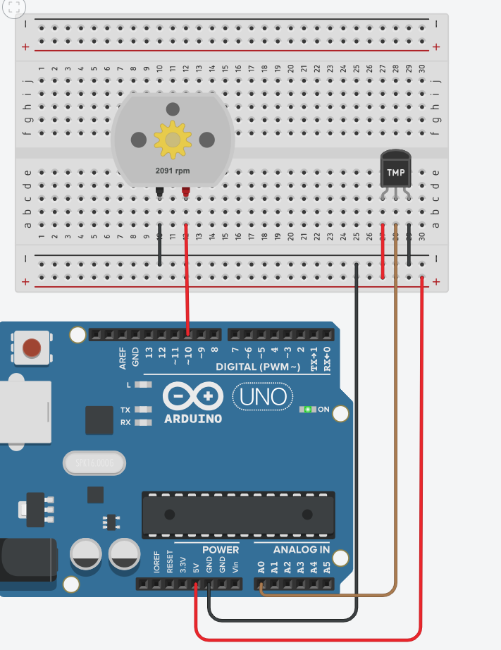

# Exemplo de Controle PID + Feedforward

Este repositório contém um exemplo de implementação de controle PID em um sistema usando Arduino.

## Descrição

O código fornecido implementa um controlador PID e feedforward simples para controlar uma variável de processo em relação a um setpoint desejado. O controlador PID é uma técnica comumente usada para sistemas de controle em que é necessário ajustar continuamente o sinal de controle com base no erro do sistema.

## Pré-requisitos

Para reproduzir este exemplo, você precisará dos seguintes itens:

- Arduino Uno (ou similar)
- Sensor de temperatura (ou outro sensor de sua escolha)
- Atuador (por exemplo, um LED, motor, etc.)

## Montagem do Circuito

Conecte o sensor de temperatura ao pino analógico A0 do Arduino e o atuador (LED, motor, etc.) ao pino digital 10.

## Como Executar

1. Faça o upload do código `pid.ino` para o Arduino usando a IDE do Arduino ou seu método preferido.
2. Abra a porta serial para visualizar a leitura da variável de processo, o erro e o valor do sinal de controle.
3. Observe como o controlador PID ajusta o sinal de controle para tentar manter a variável de processo próxima ao setpoint.

## Circuito

  

